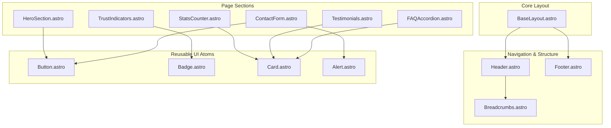
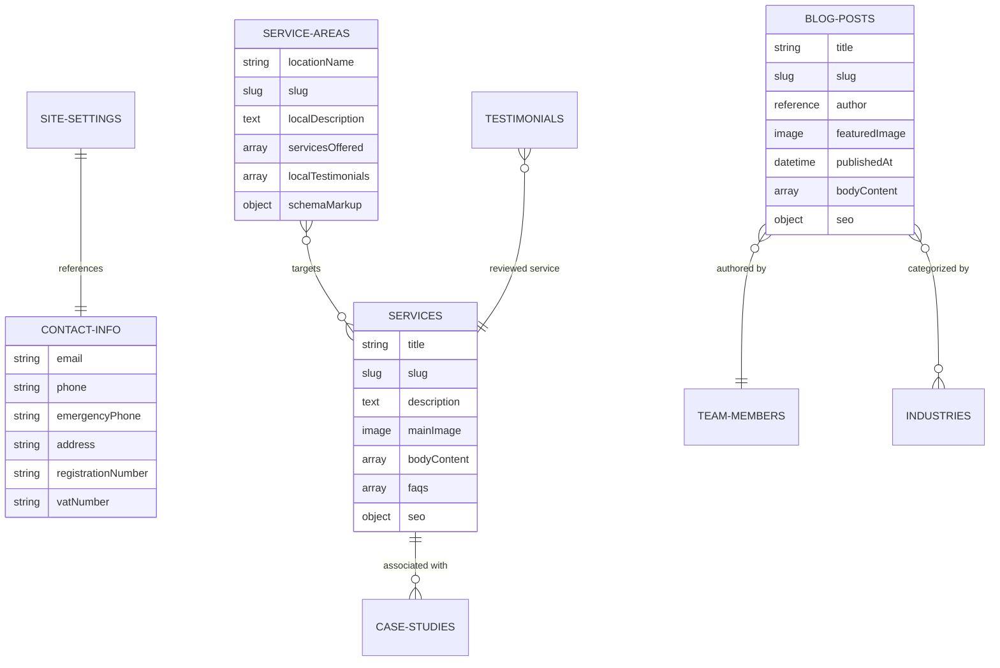
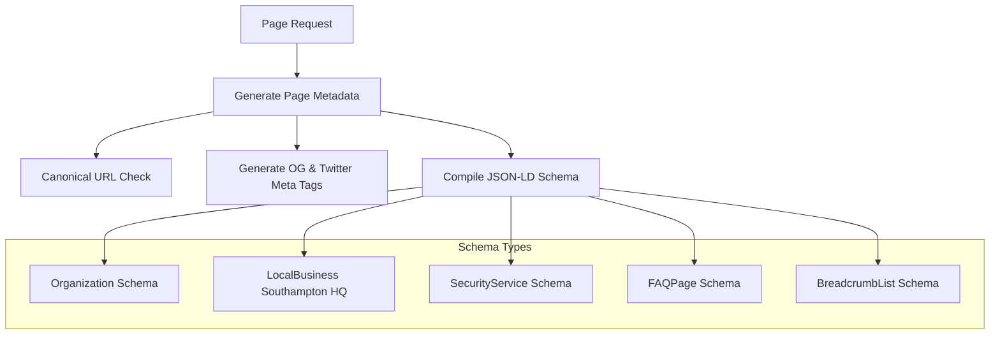
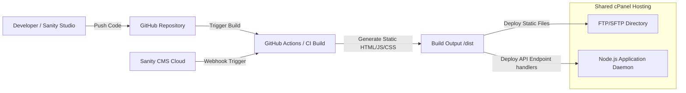
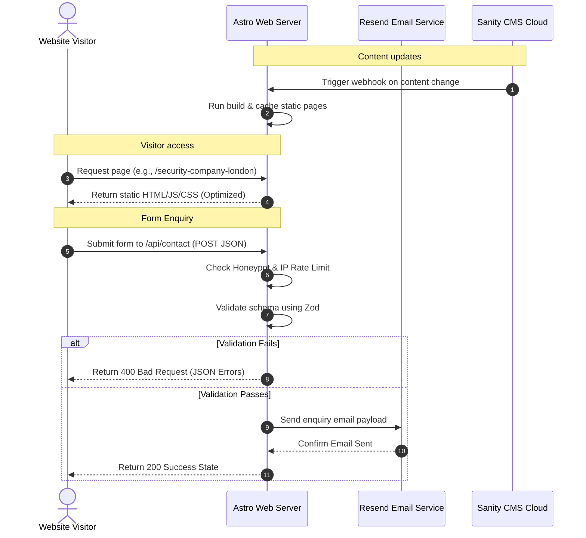

# SQS Security - Solution Architecture Plan (Phase 1)

This document outlines the Enterprise Solution Architecture for the new SQS Security corporate website. Built on **Astro 5**, **Tailwind CSS 4**, and **Sanity CMS**, the platform is designed to be static-first, highly performant, fully type-safe, and search-optimized for local UK markets.

---

## 1. Folder Structure

The project uses a standard Astro 5 directory layout optimized for content-driven sites, separation of concerns, and TypeScript type-safety.

```text
sqs-ws/
├── .github/                  # CI/CD workflows (e.g., GitHub Actions for build checks)
├── public/                   # Static assets (favicons, robots.txt, fallback OG images)
│   ├── assets/
│   │   ├── branding/         # SVG versions of official logos (horizontal, stacked, icon-only, etc.)
│   │   └── placeholders/     # Optimized temporary assets (if needed)
│   ├── robots.txt
│   └── sitemap-index.xml     # Generated dynamically at build time
├── src/
│   ├── assets/               # Local images & illustrations (processed by Astro Image)
│   ├── components/           # Reusable UI components
│   │   ├── common/           # Buttons, Badges, Cards, Alerts, UI elements
│   │   ├── layout/           # Header, Footer, Navigation, Breadcrumbs
│   │   ├── sections/         # Homepage & page section layouts (Hero, Stats, Testimonials, FAQ)
│   │   └── forms/            # Contact, Careers, and Enquiry forms
│   ├── content/              # Local static collections (if not managed by Sanity)
│   │   └── config.ts         # Zod schemas for local contents/validation
│   ├── layouts/              # Main HTML layouts
│   │   ├── BaseLayout.astro  # Core layout with SEO & script integrations
│   │   └── PageLayout.astro  # Inner pages layout with standard Header/Footer
│   ├── lib/                  # Library configurations & clients
│   │   ├── sanity.ts         # Sanity client config & query helpers (GROQ queries)
│   │   ├── resend.ts         # Resend client for email notifications
│   │   └── utils/            # Helper functions (slug generators, date formatters, SEO helpers)
│   ├── pages/                # File-based routing (pages and API endpoints)
│   │   ├── api/              # Serverless API routes (e.g., form submissions, search)
│   │   │   └── contact.ts    # Rate-limited endpoint for Resend integration
│   │   ├── blog/
│   │   │   ├── index.astro   # Blog listing page
│   │   │   └── [slug].astro  # Dynamic blog posts
│   │   ├── services/
│   │   │   ├── index.astro   # Services listing page
│   │   │   └── [slug].astro  # Dynamic service pages
│   │   ├── [localArea].astro # Dynamic local SEO service area pages (e.g., /security-company-london)
│   │   ├── index.astro       # Homepage
│   │   ├── contact.astro     # Contact page
│   │   └── 404.astro         # Custom 404 Error page
│   ├── schemas/              # Zod validation schemas for forms and API requests
│   │   └── contactSchema.ts
│   ├── styles/               # Global CSS & Tailwind configuration
│   │   └── global.css        # Tailwind CSS 4 directives & custom theme rules
│   └── types/                # TypeScript type declarations
│       ├── sanity.types.ts   # Generated types from Sanity schema
│       └── global.d.ts       # Global custom types
├── sanity/                   # Sanity Studio folder (for local development or monorepo deployment)
│   ├── schemas/              # Document & object schemas for CMS
│   ├── sanity.config.ts
│   └── sanity.cli.ts
├── astro.config.mjs          # Astro 5 configuration
├── tailwind.config.js        # Custom theme definitions (if needed outside global.css variables)
├── tsconfig.json             # TypeScript configuration
└── package.json              # Project dependencies & scripts
```

---

## 2. Component Architecture

The component architecture follows an **Atomic/Modular Design Pattern**, ensuring that visual elements are highly reusable, configurable, and completely style-decoupled from specific pages.



### Component Categories

1. **Atoms (UI Basics)**:
   * `Button.astro`: Supports primary, secondary, outline, text, and emergency-red variants. Fully type-safe props.
   * `Badge.astro`: Displays status, accreditations, or categorization labels (e.g., "SIA Approved", "Active").
   * `Alert.astro`: Standard feedback messages (Success, Error, Info, Warning) with clean transitions.
   * `Card.astro`: Reusable content container (used for services, blog posts, stats, and testimonials) featuring subtle hover animations.

2. **Molecules (Compound Blocks)**:
   * `FormInput.astro` / `FormTextarea.astro`: Standard form inputs with dynamic client-side and server-side validation error displays.
   * `FAQAccordion.astro`: Interactive, fully accessible FAQ elements conforming to WCAG keyboard navigation requirements.

3. **Organisms (Full Sections)**:
   * `Header.astro` & `Footer.astro`: Navigation bars and details featuring local UK numbers, active dynamic links, and the official primary SQS Security logo.
   * `HeroSection.astro`: Clean, split-layout header featuring a direct emergency contact call-to-action (CTA), trusted security copy, and optimized background images.

---

## 3. CMS Architecture (Sanity)

Sanity CMS is structured to manage content dynamically. The architecture utilizes specific document types and reusable fields to construct a robust content model.



### Document Schemas & Fields

1. **Site Settings**: Singleton document containing global SEO settings, site title, fallback Open Graph images, Google Analytics tags, and brand logo links.
2. **Contact Information**: Singleton containing central address details (Southampton headquarters), official business phone, emergency direct-line, email, and UK registration parameters.
3. **Services**: Dynamic services configuration (e.g., Manned Guarding, Key Holding). Includes description, detailed content blocks, target icons, dynamic FAQ listings, and custom call-to-actions.
4. **Service Areas**: Configured for local UK SEO targeting. Defines the dynamic routing rules and custom copy for Southampton, London, Portsmouth, etc.
5. **Blog Posts**: Manages case files, security guides, company updates, authors, and industry categories.
6. **Industries**: Content configuration mapping to corporate, retail, maritime, education, healthcare, logistics, and construction.
7. **Testimonials**: Stores client feedback, company names, logo attachments, ratings, and maps to specific services.
8. **FAQs**: General frequently asked questions, categorized for global display or dynamic service inclusion.
9. **Team Members & Careers**: Defines the human-facing elements of SQS Security (SIA licensing numbers, profiles, active job vacancies).
10. **Case Studies**: Details operational security deployments, specific challenges solved, results achieved, and links to relevant industries.
11. **Accreditations**: Manages official credentials (SIA Approved Contractor, ISO Certifications, SafeContractor, etc.).

---

## 4. Routing Architecture

Astro's static routing determines how visitors access sections of the site. We implement clean, readable, UK local-search-friendly paths.

```text
/                                   -> Homepage (Static)
/about                              -> About Us & Accreditations (Static)
/contact                            -> Contact & Enquiry page (Static/SSR Hybrid)
/services                           -> Directory of all Security Services (Static)
/services/[service-slug]            -> Dynamic Service details (e.g., /services/manned-guarding) (Static)
/industries/[industry-slug]         -> Industry-specific pages (e.g., /industries/maritime-security) (Static)
/blog                               -> News and Guides directory page (Static)
/blog/[blog-slug]                   -> Blog details (Static)
/security-company-[local-area]      -> Localized SEO Landing pages (e.g., /security-company-southampton) (Static)
/api/contact                        -> Form processing endpoint (Hybrid SSR or Serverless Function)
```

* **Static Site Generation (SSG)**: Service pages, blogs, and local landing pages are fully built at compile time using Astro's `getStaticPaths()`. This ensures instant load times, matching UK core web vitals goals.
* **Dynamic Generation Hook**: Incremental builds trigger via Sanity webhooks when content changes.

---

## 5. SEO Architecture

The platform prioritizes local organic search performance (Southampton, Portsmouth, London, Winchester, etc.) and semantic markup.



### Key SEO Configurations

* **Dynamic Meta Management**: Uses a custom `<SEO />` Astro component included in `BaseLayout.astro`. Reads page titles, meta descriptions, and page slugs dynamically.
* **Open Graph & Twitter Cards**: Automated image scaling and markup utilizing Astro Image optimizations.
* **Canonical URLs**: Built dynamically using the `sqssecurity.co.uk` root configuration to prevent duplicate content flags (especially on location-based service pages).
* **JSON-LD Schema Integration**:
  * **Organization**: Applied on the Homepage. Contains official brand settings, contact channels, and social profiles.
  * **LocalBusiness (Southampton HQ)**: Contains address records, coordinates, and local phone indicators.
  * **SecurityService**: Built dynamically for the `/services/[slug]` files. Highlights specific security offerings, licenses, and coverage areas.
  * **FAQ**: Embedded automatically on any page using the FAQ list components.
  * **BreadcrumbList**: Enables clear breadcrumb hierarchy indexing in Google Search results.
* **Sitemap & Robots**: Powered by `@astrojs/sitemap`. Automatically index all paths, excluding API paths and staging redirects.

---

## 6. Deployment Architecture (Shared cPanel / Node.js)

The deployment is designed for static-first delivery, offering low latency and low hosting costs, with dynamic endpoints where needed.



### Static-First Deployment Strategy (cPanel Environment)

1. **Astro Hybrid Rendering**:
   * The pages are rendered statically at build time (SSG) for fast performance.
   * The Contact and Inquiry API endpoints (`/api/contact`) use dynamic SSR, running on the cPanel Node.js Daemon.
2. **Build and Deployment Automation**:
   * Code updates and Sanity Content publishes trigger a GitHub Actions workflow.
   * The workflow runs Astro builds, executes TypeScript type checks, validates Tailwind assets, and pushes the production-ready `/dist` folder directly to the cPanel `public_html` directory via secure SFTP.
3. **Form Processing**:
   * Form submission calls `/api/contact` via client-side fetch.
   * The endpoint executes Zod validation, checks honeypot/rate limits, and relays messages to the operations team via the **Resend API**.

---

## 7. Data Flow Architecture

The data architecture handles CMS updates, client interactions, and form submissions securely.



### Key Data Cycles

1. **Content Cycle**: Content is managed in Sanity CMS. Upon publishing, webhooks trigger static regeneration.
2. **Interactive Form Cycle**: Validations are enforced in both the client UI and the server API. The honeypot field catches bots before they reach the Resend API, keeping operational costs low.
